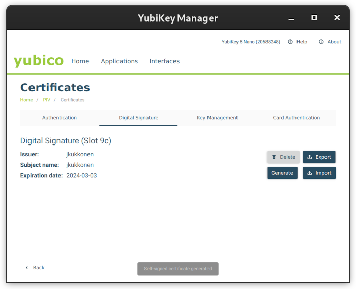

# YubiKey PIV Setup

This guide walks through using the YubiKey Manager UI to configure PIV for TUF signing operations.

> [!IMPORTANT]
> This is a general setup guide for using YubiKey with TUF-on-CI. When provisioning YubiKeys for production TUF use, you may want to consider additional procedures around the procurement, distribution, and configuration of the devices. (e.g. serial number tracking, offline device configuration, YubiKey Manager CLI, hardware random number generators, etc.)

### Requirements

- Download [YubiKey manager](https://yubico.com/support/download/yubikey-manager/):
  

> [!TIP]
> Use https://www.yubico.com/genuine/ to confirm that your YubiKey device is genuine

### Update PIV PIN Defaults

A new YubiKey is configured with a default PIN, PUK (PIN unlock code), and Management Key.

The default PIN codes must be updated with new values that you remember or store securely.

PIN codes are used for signing operations and to unlock a device.

#### Reset PIV to Defaults

> [!CAUTION]
> Performing this operation will destroy all existing PIV data

1. Navigate to the `Applications` > `PIV` menu in the YubiKey Manager UI
1. Under `Reset`, select `Reset PIV`

#### Set PIN

The PIV PIN is used to perform PIV operations such as signing and decrypting.

1. Navigate to the `Applications` > `PIV` menu in the YubiKey Manager UI
1. Under `PIN Management`, select `Configure PINs`
1. Under `PIN`, select `Change PIN`
1. Select the `Use default` checkbox for `Current PIN`
1. Enter an 8-digit PIN that only you know, or generate a random PIN that you can store securely
1. Select `Change PIN`

#### Set PUK (PIN unlock code)

The PUK PIN is used to unclock a device after a number of failed PIN entry attempts.

1. Navigate to the `Applications` > `PIV` menu in the YubiKey Manager UI
1. Under `PIN Management`, select `Configure PINs`
1. Under `PUK`, select `Change PUK`
1. Select the `Use default` checkbox for `Current PUK`
1. Enter an 8-digit PIN that only you know, or generate a random PIN that you can store securely
1. Select `Change PUK`

#### Set Management Key

The management key is used to perform many YubiKey management operations, such as generating a key pair.

1. Navigate to the `Applications` > `PIV` menu in the YubiKey Manager UI
2. Under `PIN Management`, select `Configure PINs`
3. Under `Management Key`, select `Change Management Key`
4. Select the algorithm, recommend selecting `AES256`
> [!NOTE]
> The option to use an AES key is only available for [YubiKeys with firmware 5.4.2 or newer](https://docs.yubico.com/hardware/yubikey/yk-tech-manual/yk5-overview.html#piv-management-key-aes)
5. Select `Generate` or generate a management key outside of the UI and populate the value here
6. Select `Protect with PIN`, if you want to store the management key on the device
7. Select `Finish`

### Generate Digital Signature Certificate

1. Navigate to the `Applications` > `PIV` menu in the YubiKey Manager UI
1. Under `Certificates`, select `Configure Certificates`
1. Select `Digital Signature`
1. Select `Generate`, or import an existing digital signature certificate
1. Select `Self-signed certificate` unless you are using a CA to issue the certificate via a CSR
1. Select the algorithm to be used for digital signatures
1. Populate the `Subject` field, this can be anything (recommend using your GitHub handle)
1. Select an `Expiration date`, this is the date the signing cert expires but the signing keys can still be used for TUF-on-CI after expiration
1. Select `Generate`

After generating the digital signature certificate, continue the TUF-on-CI [signer setup process](SIGNER-SETUP.md).
